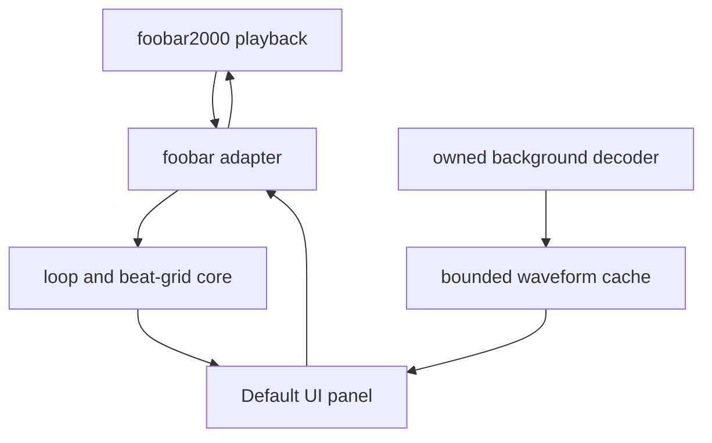

# Architecture

## Purpose

Loop Finder is a foobar2000 v2 x64 component for discovering musical loops in
the currently playing track. It separates portable musical/audio-domain logic
from foobar2000 lifecycle code and Windows UI code so the core remains easy to
test.

## System boundaries



The decoder, cache and panel boundaries are implemented for M3; consult
`ROADMAP.md` for build and manual-acceptance status.

## Modules

### Portable core

Locations:

```text
include/loop_finder/
src/core/
```

Responsibilities:

- `LoopState`: BPM, grid offset, meter, subdivision, IN/OUT and opt-in state.
- `LoopEngine`: validated state transitions and loop-boundary decisions.
- `beat_grid`: beat duration, marker snapping and visible grid-line generation.
- `waveform`: reduction of interleaved PCM into display-ready min/max/RMS bins.
- `StreamingWaveformReducer`: bounded incremental PCM reduction.
- `resample_waveform`: normalized viewport selection and drawing-width
  resampling without changing cached data.

Constraints:

- No foobar2000, Win32 or UI headers.
- No filesystem, persistence or playback-control ownership.
- Deterministic behavior covered by unit tests.
- Constructing or restoring the engine leaves Loop disabled.

### foobar2000 adapter

Location:

```text
src/foobar/
```

Current responsibilities:

- Declare component identity and version.
- Register the Default UI panel and adapt main-thread playback callbacks into
  panel state.
- Decode local tracks with SDK input decoders on one owned worker thread.
- Cancel obsolete work and publish immutable waveform snapshots on the main
  thread.
- Keep an eight-entry in-memory LRU cache.

Later responsibilities:

- Translate UI actions into core state transitions.
- Seek from OUT to IN when looping is enabled.
- Prevent feedback loops and avoid intercepting user seeks.
- Persist per-track analysis and marker state, never the active Loop flag.

The adapter owns SDK objects and threading rules. SDK types must not leak into
the portable core.

### Native build

Location:

```text
native/
build.ps1
```

Responsibilities:

- Build Release or Debug x64 with MSVC v143.
- Accept an external foobar2000 SDK root.
- Build and link the required SDK projects.
- Produce `foo_loop_finder.dll`.
- Package the DLL at the root of `foo_loop_finder.fb2k-component`.

The official SDK is an external build dependency and must not be committed.

### Default UI panel

The panel is a native child window under `src/foobar`. It follows
the SDK's `ui_element`/`ui_element_instance` pattern, consumes the host's color
and font callbacks, and scales its layout from the window DPI. It shows the
current title, playback state, waveform status, waveform and playback cursor
while keeping Loop visibly and functionally off. Click-to-seek calls the SDK
only from the main thread and only when playback reports seeking is supported.

The waveform opens in a whole-track overview. Mouse-wheel zoom is centered on
the pointer, dragging pans a zoomed viewport, and double-click restores the
overview. Cached bins do not depend on the HWND size or DPI; the portable core
resamples the selected range for each paint.

Later editor controls:

- beat and bar grid;
- BPM value and tap tempo;
- grid phase/offset;
- draggable IN and OUT markers;
- snapping division;
- Loop toggle, visually and functionally off by default.

Rendering consumes immutable snapshots of core and waveform data. UI events
request state changes; they do not mutate audio-thread state directly.

## Playback model

### Initial transport

The first functional loop implementation observes playback position. Once the
position reaches OUT and Loop is enabled, it requests a seek to IN. It must
distinguish its own automatic seek from a user seek and tolerate callback
jitter.

This implementation validates product behavior but may have an audible gap or
click at the boundary.

### Later click-free transport

A later buffered implementation may keep the selected region in memory and
apply a short crossfade around the loop boundary. Sample-accurate looping must
not be claimed while transport still relies on ordinary playback-position
callbacks and seeking.

## Waveform and analysis

Track analysis is performed outside the real-time playback path:

1. A main-thread playback callback captures the `metadb_handle`, creates a
   stable identity from path, subsong, file size, timestamp and the explicit
   waveform format version (`waveform-v2`), then checks the LRU cache.
2. A single joinable worker uses the official SDK 2025-03-07
   `input_entry::g_open_for_decoding`, `input_decoder::get_info`,
   `initialize(input_flag_simpledecode)` and `run(audio_chunk)` sequence.
3. Each decoded interleaved PCM chunk is converted to portable floats and fed
   to `StreamingWaveformReducer`. Adaptive bin compaction bounds temporary and
   cached analysis memory.
4. Completion captures an immutable `shared_ptr<const WaveformSnapshot>` and
   queues delivery with `fb2k::inMainThread`.
5. Both an SDK `abort_callback_impl` and a monotonically increasing generation
   reject obsolete work. The panel also compares the stable identity, so an old
   completion cannot overwrite a newer track even if cancellation races.

The worker is owned by the panel analysis controller; it is never detached.
Destruction disables queued delivery, signals cancellation, and joins the
worker before releasing state. No `playback_control` or panel/window operation
is performed by the worker. A 50 ms main-thread timer is active only while a
waveform is available and playback is running; cursor work is skipped until it
crosses a display pixel, and the timer is stopped on pause, stop and
destruction.

The LRU holds at most eight resolution-independent snapshots (up to 262,144
bins per track, about 24 MiB total for bin payloads at full resolution). It is
deliberately in-memory only. Remote/unrecognized inputs and
tracks with zero or unknown duration are reported as unavailable; unsupported
decoder and I/O failures are contained as panel status rather than propagated
to the host.

Waveform drawing uses a panel-size-dependent off-screen GDI layer derived from
the immutable snapshot. Zoom, navigation, resize, DPI, theme or analysis-state
changes invalidate that disposable layer. Ordinary playback ticks do not
rebuild it: the panel waits until the cursor crosses a display pixel, then
invalidates only the old and new cursor strips and restores them with `BitBlt`.
This keeps the cached analysis drawing-independent while avoiding whole-panel
or whole-waveform redraws during playback.

Pan and zoom rendering is also completed in the off-screen layer before the
visible surface changes. The paint path does not clear a waveform-only update;
it keeps the prior frame visible and replaces it with one `BitBlt` after the
new viewport has been rendered.

Automatic BPM and beat detection are separate analysis outputs. Manual BPM,
tap tempo and grid phase remain available because automatic estimates can be
half-time, double-time or phase-shifted.

## Drum overlay direction

The optional drum system is a later DSP/sequencer boundary, not part of the
waveform panel:

- styles: Boom bap, Funk, Rock and Jazz;
- shared BPM and phase with the visible grid;
- independent enable, pattern, kit, volume and optional swing;
- licensed samples must be original, CC0 or explicitly redistributable;
- enabling drums must never implicitly enable track looping, or vice versa.

## Persistence

Persist per-track data such as:

- manual or detected BPM;
- grid offset and meter;
- snapping subdivision;
- IN and OUT markers;
- waveform/analysis cache metadata.

Do not persist Loop as active. A new application/component session always
starts with Loop disabled.
