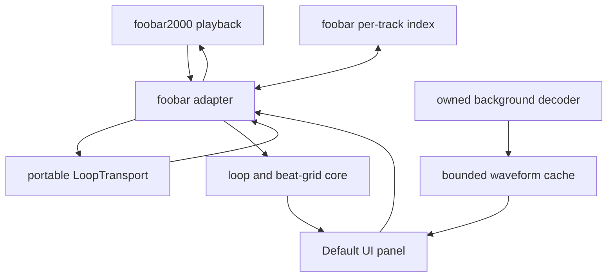

# Architecture

## Purpose

Loop Finder is a foobar2000 v2 x64 component for discovering musical loops in
the currently playing track. It separates portable musical/audio-domain logic
from foobar2000 lifecycle code and Windows UI code so the core remains easy to
test.

## System boundaries



The decoder, cache and panel boundaries are implemented for M3; consult
`ROADMAP.md` for build and manual-acceptance status.

## Modules

### Portable core

Locations:

```text
include/loop_finder/
src/core/
```

Responsibilities:

- `LoopState`: BPM, grid offset, meter, subdivision, IN/OUT and opt-in state.
- `LoopEngine`: validated BPM, phase, meter, snapping, marker, enable and
  track-duration-clamping transitions plus loop metrics.
- `LoopTransport`: explicitly stateful, generation-checked OUT-crossing and
  manual/automatic-seek coordination with no SDK or UI types.
- `beat_grid`: beat duration, marker snapping and bounded visible grid-line
  generation with subdivision/beat/bar classification.
- `TapTempo`: timeout-aware rolling-median tempo calculation from monotonic tap
  timestamps.
- `waveform`: reduction of interleaved PCM into display-ready min/max/RMS bins.
- `StreamingWaveformReducer`: bounded incremental PCM reduction.
- `resample_waveform`: normalized viewport selection and drawing-width
  resampling without changing cached data.

Constraints:

- No foobar2000, Win32 or UI headers.
- No filesystem, persistence or playback-control ownership.
- Deterministic behavior covered by unit tests.
- Constructing or restoring the engine leaves Loop disabled.

### foobar2000 adapter

Location:

```text
src/foobar/
```

Current responsibilities:

- Declare component identity and version.
- Register the Default UI panel and adapt main-thread playback callbacks into
  panel state.
- Decode local tracks with SDK input decoders on one owned worker thread.
- Cancel obsolete work and publish immutable waveform snapshots on the main
  thread.
- Keep an eight-entry in-memory LRU cache.
- Translate M4 controls and marker gestures into `LoopEngine` transitions.
- Persist versioned per-track editor records through `metadb_index_manager`.
- Feed main-thread playback-time, playback-seek and polled position events into
  `LoopTransport`, then issue accepted seek requests through `playback_control`.
- Force Loop off on stop, track change, shutdown and unseekable media.

Later responsibilities:

- Persist later automatic-analysis outputs separately from manual overrides.

The adapter owns SDK objects and threading rules. SDK types must not leak into
the portable core.

### Native build

Location:

```text
native/
build.ps1
```

Responsibilities:

- Build Release or Debug x64 with MSVC v143.
- Accept an external foobar2000 SDK root.
- Build and link the required SDK projects.
- Produce `foo_loop_finder.dll`.
- Package the DLL at the root of `foo_loop_finder.fb2k-component`.

The official SDK is an external build dependency and must not be committed.

### Default UI panel

The panel is a native child window under `src/foobar`. It follows
the SDK's `ui_element`/`ui_element_instance` pattern, consumes the host's color
and font callbacks, and scales its layout from the window DPI. Persistent native
edit, button, combo-box and checkbox children provide BPM, tap tempo, phase,
snapping, Set IN/OUT and seek-based Loop controls. Enter or focus loss commits
numeric edits, Escape restores the last valid value, and Ctrl+T records a tap.
All editor changes request validated core transitions. The Loop toggle controls
the M5 transport but is never persisted.

The waveform opens in a whole-track overview. Mouse-wheel zoom is centered on
the pointer, dragging pans a zoomed viewport, and double-click restores the
overview. Cached bins do not depend on the HWND size or DPI; the portable core
resamples the selected range for each paint.

Mouse interaction is unambiguous: a marker hit starts a captured marker drag;
empty-space drag pans; empty-space click seeks; the wheel zooms; double-click
restores the overview. Capture loss, track change and destruction cancel marker
drags. Dragging only changes editor state and never repeatedly seeks playback.

Rendering consumes immutable snapshots of core and waveform data. UI events
request state changes; they do not mutate audio-thread state directly.

## Playback model

### Initial transport

M5 uses foobar2000's main-thread `on_playback_time` and `on_playback_seek`
callbacks together with the panel's existing 50 ms playback-position timer.
The timer also runs while Loop is enabled before waveform analysis completes.
Only the adapter calls `playback_control::playback_seek`; transport decisions
remain portable and painting never performs transport work. A callback records
the request and queues `fb2k::inMainThread`, so the actual seek runs on a later
main-loop turn rather than re-entrantly inside `on_playback_time`. The deferred
handler revalidates the request ID and generation, active panel, current track,
Loop state, pause state and seekability before touching playback control.

`LoopTransport` has these explicit states:

- `disabled`: no request is possible; the reset reason records Loop off, stop,
  track change, invalid markers, unseekable media or component shutdown;
- `armed`: a prior position below OUT establishes a normal forward crossing;
- `automatic_seek_pending`: one generation- and request-ID-bearing IN seek has
  been returned to the adapter, so repeated callbacks beyond OUT are ignored;
- `waiting_for_loop_in`: the matching automatic seek callback has been consumed
  and playback must next be observed back inside the loop before re-arming;
- `manually_disarmed`: a user seek outside the loop is accepted and no automatic
  seek is allowed until playback is observed inside again.

Every Loop activation and marker change increments a transport generation.
Requests carry that generation and a monotonically increasing request ID.
Loop off, stop, track change and shutdown clear pending intent; old-generation
events are ignored. Marker changes cancel pending intent and establish a new
baseline from the current position, so an already-past-OUT callback cannot
immediately seek. If more than one Loop Finder panel exists, arming one panel
disarms the previous owner to prevent duplicate component seeks.

Manual seek notifications are never passed through forward-crossing logic.
A seek inside `[IN, OUT)` re-arms at the accepted location. A seek outside enters
`manually_disarmed` without snapping back; observation inside the interval, or
an explicit Loop off/on cycle, makes a later normal crossing eligible again.
While an automatic request is pending, only a callback near its target and with
the current generation consumes that intent. The state then waits for a later
position observation inside the loop, preventing recursive seeks even for very
short regions.

This implementation uses ordinary host seek operations rather than an audio
buffer or DSP boundary. Callback scheduling, output buffering and decoder seek
behavior therefore add host- and source-dependent latency and can produce an
audible gap or click. It is not click-free or sample-accurate; buffered,
crossfaded looping is deferred to M7.

Portable diagnostics retain the observed crossing position, requested IN,
OUT overshoot, the first position observed back inside, and elapsed wall time
from request to that observation. Debug native builds emit one foobar2000
console line at the request and one on return; Release builds stay silent.
Boundary jitter is evaluated by repeating loops and comparing these values with
OUT/IN. No latency or jitter number is documented until an actual foobar2000
run records it.

### Later click-free transport

A later buffered implementation may keep the selected region in memory and
apply a short crossfade around the loop boundary. Sample-accurate looping must
not be claimed while transport still relies on ordinary playback-position
callbacks and seeking.

## Waveform and analysis

Track analysis is performed outside the real-time playback path:

1. A main-thread playback callback captures the `metadb_handle`, creates a
   stable identity from path, subsong, file size, timestamp and the explicit
   waveform format version (`waveform-v2`), then checks the LRU cache.
2. A single joinable worker uses the official SDK 2025-03-07
   `input_entry::g_open_for_decoding`, `input_decoder::get_info`,
   `initialize(input_flag_simpledecode)` and `run(audio_chunk)` sequence.
3. Each decoded interleaved PCM chunk is converted to portable floats and fed
   to `StreamingWaveformReducer`. Adaptive bin compaction bounds temporary and
   cached analysis memory.
4. Completion captures an immutable `shared_ptr<const WaveformSnapshot>` and
   queues delivery with `fb2k::inMainThread`.
5. Both an SDK `abort_callback_impl` and a monotonically increasing generation
   reject obsolete work. The panel also compares the stable identity, so an old
   completion cannot overwrite a newer track even if cancellation races.

The worker is owned by the panel analysis controller; it is never detached.
Destruction disables queued delivery, signals cancellation, and joins the
worker before releasing state. No `playback_control` or panel/window operation
is performed by the worker. A 50 ms main-thread timer is active while playback
is running and either a waveform is available or seek-based Loop is enabled.
Cursor work is skipped until it crosses a display pixel, transport work is
constant-time, and the timer is stopped on pause, stop and destruction.

The LRU holds at most eight resolution-independent snapshots (up to 262,144
bins per track, about 24 MiB total for bin payloads at full resolution). It is
deliberately in-memory only. Remote/unrecognized inputs and
tracks with zero or unknown duration are reported as unavailable; unsupported
decoder and I/O failures are contained as panel status rather than propagated
to the host.

Waveform drawing uses a panel-size-dependent off-screen GDI base layer derived
from the immutable snapshot. A second disposable presentation layer copies that
base and adds bounded grid lines. BPM and phase changes invalidate this grid
layer without rebuilding the waveform base or rerunning analysis. The two
lightweight IN/OUT marker lines and playback cursor are drawn over the cached
grid layer. Marker drags invalidate only the old and new marker strips, skip
repainting when snapping leaves the marker unchanged, and refresh textual
values on release. Ordinary playback ticks invalidate only old and new cursor
strips and restore the already composed presentation with `BitBlt`.

Pan and zoom rendering is also completed in the off-screen layer before the
visible surface changes. The paint path does not clear a waveform-only update;
it keeps the prior frame visible and replaces it with one `BitBlt` after the
new viewport has been rendered.

Automatic BPM and beat detection are separate analysis outputs. Manual BPM,
tap tempo and grid phase remain available because automatic estimates can be
half-time, double-time or phase-shifted.

## Drum overlay direction

The optional drum system is a later DSP/sequencer boundary, not part of the
waveform panel:

- styles: Boom bap, Funk, Rock and Jazz;
- shared BPM and phase with the visible grid;
- independent enable, pattern, kit, volume and optional swing;
- licensed samples must be original, CC0 or explicitly redistributable;
- enabling drums must never implicitly enable track looping, or vice versa.

## Persistence

M4 stores per-track data through the SDK 2025-03-07
`metadb_index_manager`. The index key hashes the playable location path and
subsong only, so it is independent of the `waveform-v2` analysis identity and
survives tag edits. Moving a file changes the key; the old record then follows
the documented orphan-retention cleanup policy.

The little-endian `LFED` record has explicit schema version 1 and stores BPM,
grid offset, beats per bar, snapping mode, IN and OUT seconds. Missing and
corrupt data fall back to defaults. Schema 0 records are accepted with snapping
enabled; unknown future schemas are ignored. Every decoded field is restored
through `LoopEngine`, and construction/restoration always forces Loop off.

The SDK index retains orphaned records for 26 weeks, providing bounded cleanup
without audio-tag writes. Metadata calls occur only from main-thread UI state
transitions, never from paint, decoding or audio paths. A new application or
component session always starts with Loop disabled.
