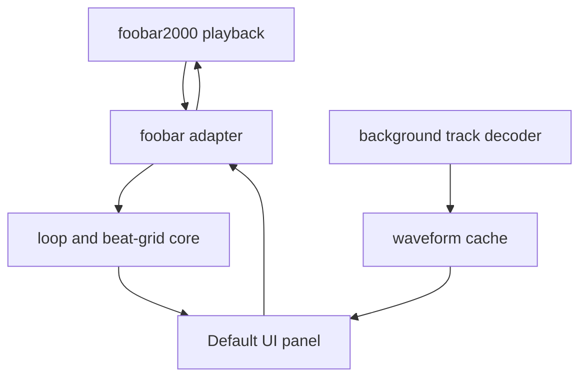

# Architecture

## Purpose

Loop Finder is a foobar2000 v2 x64 component for discovering musical loops in
the currently playing track. It separates portable musical/audio-domain logic
from foobar2000 lifecycle code and Windows UI code so the core remains easy to
test.

## System boundaries



The decoder, cache and panel are planned boundaries. The portable core and
minimal component registration already exist; consult `ROADMAP.md` for verified
status.

## Modules

### Portable core

Locations:

```text
include/loop_finder/
src/core/
```

Responsibilities:

- `LoopState`: BPM, grid offset, meter, subdivision, IN/OUT and opt-in state.
- `LoopEngine`: validated state transitions and loop-boundary decisions.
- `beat_grid`: beat duration, marker snapping and visible grid-line generation.
- `waveform`: reduction of interleaved PCM into display-ready min/max/RMS bins.

Constraints:

- No foobar2000, Win32 or UI headers.
- No filesystem, persistence or playback-control ownership.
- Deterministic behavior covered by unit tests.
- Constructing or restoring the engine leaves Loop disabled.

### foobar2000 adapter

Location:

```text
src/foobar/
```

Current responsibility:

- Declare component identity and version.

Planned responsibilities:

- Observe playback lifecycle and current position.
- Decode the current track for analysis without blocking playback.
- Translate UI actions into core state transitions.
- Seek from OUT to IN when looping is enabled.
- Prevent feedback loops and avoid intercepting user seeks.
- Persist per-track analysis and marker state, never the active Loop flag.

The adapter owns SDK objects and threading rules. SDK types must not leak into
the portable core.

### Native build

Location:

```text
native/
build.ps1
```

Responsibilities:

- Build Release or Debug x64 with MSVC v143.
- Accept an external foobar2000 SDK root.
- Build and link the required SDK projects.
- Produce `foo_loop_finder.dll`.
- Package the DLL at the root of `foo_loop_finder.fb2k-component`.

The official SDK is an external build dependency and must not be committed.

### Default UI panel

Planned initial controls:

- waveform overview and zoomed viewport;
- playback cursor;
- beat and bar grid;
- BPM value and tap tempo;
- grid phase/offset;
- draggable IN and OUT markers;
- snapping division;
- Loop toggle, visually and functionally off by default.

Rendering consumes immutable snapshots of core and waveform data. UI events
request state changes; they do not mutate audio-thread state directly.

## Playback model

### Initial transport

The first functional loop implementation observes playback position. Once the
position reaches OUT and Loop is enabled, it requests a seek to IN. It must
distinguish its own automatic seek from a user seek and tolerate callback
jitter.

This implementation validates product behavior but may have an audible gap or
click at the boundary.

### Later click-free transport

A later buffered implementation may keep the selected region in memory and
apply a short crossfade around the loop boundary. Sample-accurate looping must
not be claimed while transport still relies on ordinary playback-position
callbacks and seeking.

## Waveform and analysis

Track analysis is performed outside the real-time playback path:

1. Resolve the current playable track.
2. Decode PCM in a background task.
3. Reduce PCM to resolution-independent peak/RMS bins.
4. Cache by a stable track identity plus analysis version.
5. Publish immutable data to the panel on the correct UI thread.

Automatic BPM and beat detection are separate analysis outputs. Manual BPM,
tap tempo and grid phase remain available because automatic estimates can be
half-time, double-time or phase-shifted.

## Drum overlay direction

The optional drum system is a later DSP/sequencer boundary, not part of the
waveform panel:

- styles: Boom bap, Funk, Rock and Jazz;
- shared BPM and phase with the visible grid;
- independent enable, pattern, kit, volume and optional swing;
- licensed samples must be original, CC0 or explicitly redistributable;
- enabling drums must never implicitly enable track looping, or vice versa.

## Persistence

Persist per-track data such as:

- manual or detected BPM;
- grid offset and meter;
- snapping subdivision;
- IN and OUT markers;
- waveform/analysis cache metadata.

Do not persist Loop as active. A new application/component session always
starts with Loop disabled.

